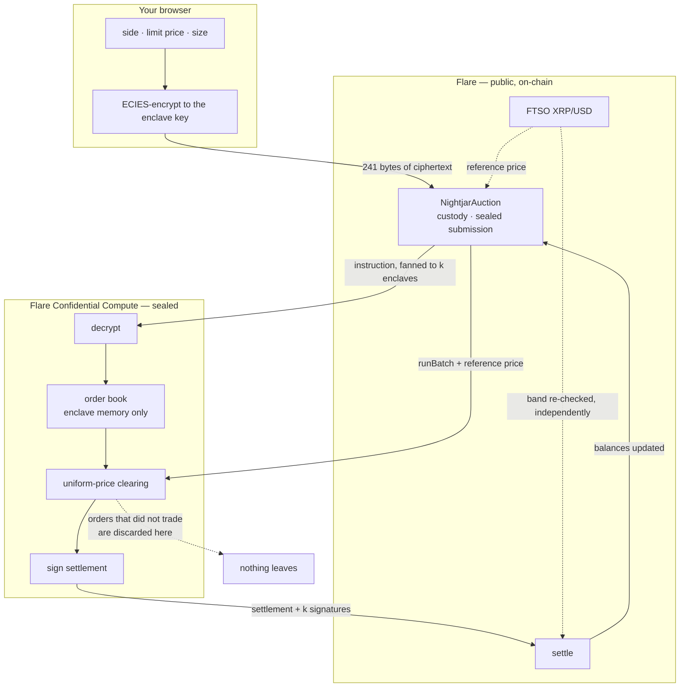
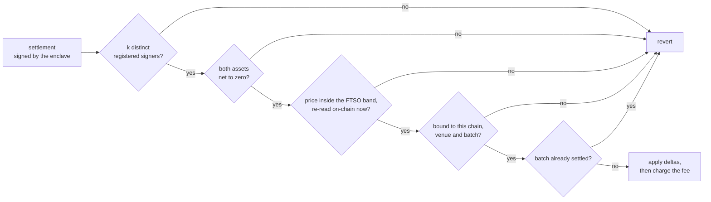
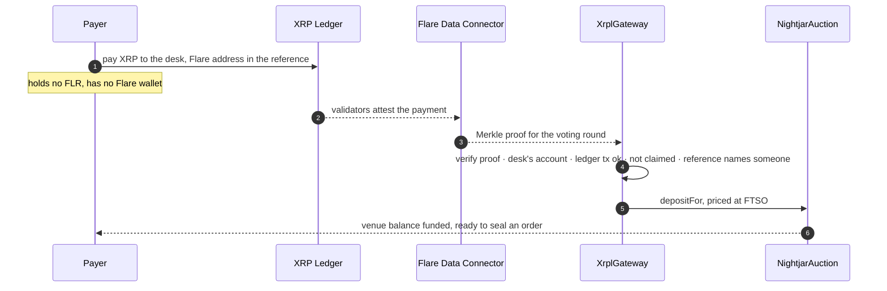

# Nightjar

**A sealed-bid venue for FXRP, matched inside a Flare TEE and settled on Flare.**

Put a large order on any public book and you have announced it. Your price and
your size are readable before you trade, and you get a worse fill. Nightjar
keeps your order encrypted until the moment it is matched, so size can rest
on-chain without telling anyone what it wants.

Built for Flare Summer Signal on Flare Confidential Compute. Targets **Bounty 2
— Confidential Compute Apps** and **Bounty 1 — Interoperable Asset Products**.

### For judges — verify the claims in about two minutes, no wallet

| | |
|---|---|
| **Live page, nothing to install** | <https://issa-me-sush.github.io/nightjar-flare/> |
| **The harm, measured** | `cd tools && go run ./cmd/run-comparison` — deploys nothing, replays the control experiment |
| **The ecosystem problem, measured** | `cd tools && go run ./cmd/fxrp-depth` — reads **Flare mainnet**, no key needed |
| **Settled batch on Coston2** | [`0x083d86d7…`](https://coston2-explorer.flare.network/tx/0x083d86d734cb021fc58b6225d4fe5f4964f65ed0c1c20990f8eb22dd5cfb2c6d) |
| **A batch where 3 of 5 orders were never revealed** | [`0xa37aee2f…`](https://coston2-explorer.flare.network/tx/0xa37aee2f156bc18bf5cd2699c15b25e7ff12d277b8d6730f6232f8364aab35f2) |
| **The XRPL rail, live** | 25 XRP paid on XRPL → [credited on Flare](https://coston2-explorer.flare.network/tx/0x64ba0a3d04258acc89c809046148a350ffb47a29d7716709cb2f0a6e0d864f12) via an FDC proof |
| **Tests** | `forge test` (51) · `cd go && go test ./...` (26) |

Everything below that is a number can be re-derived by running one of those.
Nothing here asks you to take our word for it.

---

## The problem, measured on Flare mainnet

FXRP is Flare's flagship asset. It has a large float and almost nothing on the
other side of the trade. This is not an opinion — `go run ./cmd/fxrp-depth`
reads it live from Flare mainnet and prints the addresses it read:

```
supply         149,614,009 FXRP

Where the float sits
  Firelight vault            58,464,556 FXRP  39.07%   yield vault — deposited, not quoted
  Morpho                     31,347,660 FXRP  20.95%   lending collateral
  Kinetic                    20,403,986 FXRP  13.63%   lending collateral
  LayerZero OFT adapter      16,116,081 FXRP  10.77%   bridged off Flare
  four contracts            126,332,285 FXRP  84.43%

What a seller can trade into
  in DEX pools at all         5,950,943 FXRP   3.97% of supply
  stablecoin on the far side  1,230,170        0.82% of supply, across 3 pools
```

**149.6 million FXRP outstanding. About 1.23 million dollars of stablecoin on
the other side.** Roughly one part in a hundred. If one holder in a hundred
wanted out at once there is no price at which they all get out.

Three things worth sitting with:

- **84% of the float is parked, not quoted.** It is deposited in vaults and
  lending markets earning yield. That is capital present on Flare and absent
  from the order book.
- **10.8% has already left.** The fourth-largest holder of FXRP is the
  LayerZero adapter that carries it off Flare. The holders with the most
  operational sophistication have voted with their feet.
- **The deepest FXRP pools are not exits.** The two largest are FXRP/stXRP.
  Trading FXRP for staked XRP is not leaving; it is the same risk in a
  different wrapper. Only three pools, holding $1.23M, let a holder actually
  out.

Incentives have already been tried at scale — the FAssets programme committed
billions of FLR to exactly this — and the float responded by sitting in vaults
or bridging away. That is the tell. **Depth is not missing for want of
subsidy. It is missing because quoting it publicly is what it costs you.**

And that is the one problem an ordinary smart contract cannot solve, because
on-chain state is public by construction. It needs confidential execution,
which is precisely what Flare shipped.

## What it costs to be visible

The claim above has a number attached, and we did not want to assert it. The
repo ships [`TransparentVenue.sol`](contracts/TransparentVenue.sol) — an
ordinary on-chain limit order book with the same economics — as a **control**,
and runs the identical trade through both venues.

It is deliberately not a strawman: orders rest in storage exactly as they do on
any on-chain CLOB, and the seller does nothing more exotic than call a view
function. Reading that the buyer would pay up to 1.06, he asks 1.06 instead of
the 1.02 he would have accepted. No mempool games. No searcher infrastructure.
Reading public state was enough.

| | Executed at | She paid |
|---|---|---|
| Transparent book | 1.06 — her own limit | **3.18** |
| Nightjar | 1.02 — the clearing price | **3.06** |

**392 basis points**, same 3 FXRP, same counterparty. The only difference was
whether her limit price could be read.

```
cd tools && go run ./cmd/run-comparison
```

This is a controlled demonstration on a testnet, not a market-wide estimate,
and it is worth being precise about what it does and does not show. It shows
that *a counterparty who can read your limit will quote against it*, with the
size of the loss set by the gap between your limit and your true reserve. It
does not claim every trade on every book loses 392 bps. What it establishes is
that the mechanism is real and cheap to exploit, which is the part usually
asserted.

## Why a batch auction, and not an order book

This is the design decision the whole system turns on, and it is the one thing
here that is genuinely novel rather than merely well-built.

The obvious way to build a confidential venue is to put a normal
price-time-priority order book inside an enclave. Flare's own reference
implementation does exactly that. It works — and it permanently costs you the
ability to run more than one enclave.

Price-time priority is a function of **arrival order**. Two enclaves fed the
same orders over a network will see them in different orders, produce different
matches, and sign different settlements. There is no quorum to take, because
there is nothing for them to agree on. A confidential CLOB is structurally
single-machine.

A uniform-price batch auction has no such dependency. It takes a *set* of
orders and computes the single price that maximises matched volume. Feed the
same set in any order and every enclave produces byte-identical output. That is
[tested directly](go/internal/matching/matching_test.go) — determinism under
reordering is one of the eleven matching-engine tests, and it is there because
it is the property the security model rests on.

So the venue fans each instruction to `signatureThreshold` enclaves via
`getRandomTeeIds`, and `settle()` requires **k distinct registered enclaves to
have signed the same settlement bytes**:

```solidity
function _verifyQuorum(bytes calldata _settlement, bytes[] calldata _signatures) private view {
    if (_signatures.length < signatureThreshold) revert NotEnoughSignatures();
    bytes32 digest = _settlementDigest(_settlement);
    address previous = address(0);
    for (uint256 i = 0; i < _signatures.length; ++i) {
        address signer = _recover(digest, _signatures[i]);
        if (signer == address(0)) revert BadSignature();
        if (!isTee[signer]) revert UnknownSigner();
        if (signer <= previous) revert DuplicateSigner();  // strictly increasing ⇒ distinct
        previous = signer;
    }
}
```

**Why this matters now.** Through 2025 the trust story for TEEs got materially
worse: the `wiretap.fail` and `tee.fail` results demonstrated sub-$1,000
memory-bus interposer attacks that extract attestation keys from Intel SGX/TDX
and AMD SEV-SNP, and both vendors treat physical interposition as out of scope
with no firmware fix planned. A design whose confidentiality rests on exactly
one machine now has a known, cheap, unpatched single point of failure.
Requiring k-of-n independently-attested enclaves does not make that attack
impossible, but it turns "compromise one box" into "compromise k boxes run
under different operators", which is the difference between a weekend and a
campaign.

We are not claiming to have solved TEE security. We are claiming that the
matching rule you choose determines whether you are *allowed* to defend against
it, and that a batch auction is the rule that leaves the door open.

Batch auctions also happen to be the right market design here independently:
everyone in a batch trades at one price, so being early, or ordered favourably
within a block, is worth exactly nothing. There is no ordering advantage to
sell.

**Status of the quorum, stated honestly:** the contract path is deployed, live,
and covered by six dedicated tests: one signature under a threshold of two
fails; two enclaves settle; the same enclave cannot sign twice; an unregistered
signer does not count toward the threshold; disagreeing enclaves cannot settle;
and a threshold cannot be set above the number of registered enclaves.
Coston2 currently runs it with **one registered enclave and a threshold of
one**, because registering a second independent TEE machine needs a second host
we do not have tonight. `addTee()` and `setSignatureThreshold()` are live on the
deployed venue and take it to k-of-n without a redeploy.

---

## Bounty 2 — the four questions, answered directly

The bounty asks submissions to explain what runs privately inside the TEE, what
is verified or consumed on-chain, what trust assumptions exist, and why the
product benefits from confidential compute rather than normal smart-contract
execution. Taking those in order.

### What runs privately inside the TEE

The order book and the auction. Specifically:

- **Decryption.** Orders arrive on-chain as ECIES ciphertext encrypted to the
  enclave's public key. The enclave calls the node's `/decrypt` port. The
  plaintext `{trader, side, limitPrice, size, nonce}` exists only in enclave
  memory and is never logged, returned, or written anywhere.
- **The resting book.** Open orders live in enclave memory for the life of the
  batch. There is no on-chain slot, no database, no proxy log line.
- **Uniform-price clearing.** The enclave computes the price maximising matched
  volume across all resting orders, then the resulting per-trader net deltas.
- **Destruction of what did not trade.** Unmatched orders are simply not part of
  the settlement. Their side, price and size are never emitted. This is
  demonstrated on-chain: batch 2 took **five orders, matched one pair, and three
  orders were never revealed** —
  [`0xa37aee2f…`](https://coston2-explorer.flare.network/tx/0xa37aee2f156bc18bf5cd2699c15b25e7ff12d277b8d6730f6232f8364aab35f2).

### What is verified or consumed on-chain

Deliberately, a lot — the enclave proposes and the chain disposes. `settle()`
rejects the enclave's own signed output unless all of the following hold:

| Check | What it stops |
|---|---|
| **Quorum** — k distinct registered enclave signatures over the settlement digest | A forged or single-compromised-enclave settlement |
| **Conservation** — base deltas sum to 0, quote deltas sum to 0, checked *before* fees | A batch that invents value instead of moving it |
| **Oracle band** — clearing price re-read against FTSO XRP/USD **on-chain at settlement**, not just inside the enclave | An enclave clearing at a price it made up |
| **Binding** — settlement is bound to one chain id, one venue address, one batch id | Replay onto another venue or batch |
| **Attribution** — `msg.sender` recorded at submission; enclave rejects any order whose decrypted `trader` disagrees | Someone else replaying your ciphertext |
| **Fee ceiling** — `MAX_FEE_BPS = 30`, immutable in bytecode | Governance changing the deal after you deposit |

Consumed on-chain: FTSO XRP/USD via `ContractRegistry`, read **twice** — once
to seed the batch reference price, once independently at settlement.

### What trust assumptions exist

**You must trust:**

- The TEE hardware and its attestation to keep order terms confidential while
  matching. Subject to the physical-attack caveat above — which is why the
  quorum path exists.
- That the code hash registered on-chain is the code actually running. This is
  what `TeeExtensionRegistry` and reproducible builds pin down.
- **On Coston2 today, this is a simulated attestation** (`SIMULATED_TEE=true`,
  platform `TEST_PLATFORM`). The code hash is a test value, not a hardware
  quote. The architecture is unchanged and the registration path is real; the
  hardware guarantee is not yet there. Saying otherwise would be the single
  fastest way to lose your trust, and everything else here would deserve to be
  doubted along with it.

**You do not have to trust:**

- *That the enclave will not steal funds.* It never holds them. It returns
  signed balance deltas; conservation is enforced on-chain.
- *That the enclave is honest about price.* The FTSO band is re-checked on-chain
  after the enclave has spoken. A valid enclave signature is necessary and
  deliberately not sufficient.
- *That the operator will not raise fees on you.* The ceiling is in bytecode.

**Deliberately public:** that a given address submitted *an* order in a given
batch (they sent a transaction — we do not pretend otherwise); the number of
orders in a batch; and the clearing price, matched volume and per-trader net
deltas of a *settled* batch.

### Why confidential compute rather than a normal contract

Because the property being sold is *the absence of readable state*, and a smart
contract cannot offer it. Everything a contract knows, everyone knows. Every
alternative fails on something concrete:

- **Commit–reveal** requires the reveal. A participant who dislikes the outcome
  declines to reveal, and you are left choosing between griefing and forfeited
  bonds. It also cannot support a resting book — only a discrete round.
- **Encrypted state with on-chain decryption** publishes the plaintext at
  decryption time, which is exactly the moment it becomes valuable.
- **ZK proofs** hide inputs beautifully but cannot *match* across parties'
  private inputs without either an MPC layer or a trusted aggregator; the
  proving cost for a per-block auction over a live book is not close.
- **An off-chain matcher** works and is what OTC desks are. It requires trusting
  an operator who sees everything, which is the thing being removed.
- **FHE** can compute on encrypted data, and published benchmarks for
  sealed-bid auction workloads run to hours for tens of participants. Not a
  trading venue.

A TEE gives you a machine that can *hold* plaintext, act on it, and prove which
code it is running — while the chain independently constrains what that machine
is permitted to output. That combination is the product, and Flare is the only
place it is enshrined next to the asset (FXRP) and the price feed (FTSO) the
venue needs.

---

## Bounty 1 — arrive from the XRP Ledger, trade without showing your hand

FXRP's problem is no longer minting; v1.3 fixed that. Its problem is that once
minted there is nowhere to go with size — and the measurement at the top of
this file says the holders noticed, because the fourth-largest holder of FXRP
is the bridge taking it *off* Flare.

So the venue has a second door. **Pay XRP on the XRP Ledger and the payment
itself funds your balance here.**

```
XRP paid on XRPL  →  FDC attests it  →  XrplGateway verifies the proof
                                          on Flare  →  balance credited
                                          →  seal an order  →  matched in
                                             the enclave  →  settled
```

You send XRP from whatever XRPL wallet you already use, with the Flare address
to credit as the payment's standard reference. Flare's Data Connector attests
the payment. [`XrplGateway.sol`](contracts/XrplGateway.sol) verifies that proof
against the Merkle root the Data Connector published, checks the payment
actually landed in the desk's XRPL account, prices the XRP at Flare's own FTSO
feed, and credits the address the payment named — **straight into that
address's venue balance, ready to trade.** Not their wallet: they have just
arrived from a chain where they hold no FLR, so a credit that still required
them to send a deposit transaction would not actually have got them anywhere.

**This is live and has run twice on Coston2 against real XRPL testnet
payments:**

| | |
|---|---|
| 12 XRP paid on XRPL | [`0x7c68e09e…`](https://testnet.xrpl.org/transactions/7C68E09EDA054D708A808DD18DC50AC9019313D6C01797F31F53958BB13047DA) → credited [`0xe09d510e…`](https://coston2-explorer.flare.network/tx/0xe09d510e776810c1243bdb13a6c36f43a7a0f40f18862f6e106896aa28985ec8) |
| 25 XRP paid on XRPL | [`0x7fe5394c…`](https://testnet.xrpl.org/transactions/9A275B13DBABBC9FE2F98496BE840CAB369ED56C5E47D91E99B111A3B449FE58) → credited [`0x64ba0a3d…`](https://coston2-explorer.flare.network/tx/0x64ba0a3d04258acc89c809046148a350ffb47a29d7716709cb2f0a6e0d864f12) |

**In the app**, the terminal's funding panel has a *From the XRP Ledger*
section: it shows the desk's XRPL account and the reference to use, takes your
payment hash, and walks the attestation through to the credit. The relayer pays
the Flare-side fees, because someone arriving from the XRPL has no FLR yet —
and it cannot redirect a drop, since the proof names its own beneficiary.

So the whole path costs the payer exactly one signature, on the chain they
already use. They pay XRP; their Nightjar balance is funded; they seal an
order. `depositFor` is what makes that possible, and it grants no authority
over the recipient — the caller spends its own tokens and there is
deliberately no matching `withdrawFor`.

Or from the command line, against your own payment:

```bash
cd tools && go run ./cmd/xrpl-fund -tx 0x<your-xrpl-transaction-hash>
```

**What makes this more than a bridge.** The gateway never takes custody of the
XRP and cannot credit anyone on our say-so — the only thing that moves value is
a proof Flare's own validators produced. `fund()` is permissionless on purpose,
so a relayer can carry the proof for a payer who holds no FLR at all, which is
the realistic case for someone arriving from the XRPL. Eighteen tests cover the
ways it could otherwise be drained: replayed payments, payments to a different
account, failed ledger transactions, proofs about another chain, proofs the
Data Connector rejects, and a payment naming nobody.

And the destination matters. Getting XRP onto Flare is not new. Getting it onto
Flare *into a venue where you can then move size without announcing it* is the
part that is missing, and it is why the two halves belong in one product: the
reason 10.8% of FXRP has left is the reason a new door is worth building.

The base asset is the **real FAssets FXRP** on Coston2 (`FTestXRP`, not a mock).

## Who it is for

The people who currently pick up the phone. When someone wants to move real
size in crypto today they do not use a DEX — they message an OTC desk, take a
private quote, and settle bilaterally. That whole industry exists because
public books leak intentions.

- **Desks moving size.** Split a large order across thirty fills and you are
  still detected. Rest it once here instead.
- **Market makers.** Quotes stay hidden until matched, so quoting real size
  stops meaning being adversely selected for it. That is why books are thin.
- **Treasuries and funds.** Rebalance an XRP position without broadcasting the
  position or the intent — for most institutions, the difference between using
  DeFi and not.

**Who it is not for:** anyone swapping 50 FXRP. Too small to be worth
attention, and an ordinary DEX serves them fine. This is infrastructure for
size.

The honest risk, named: every standalone dark pool in crypto has failed on
cold-start liquidity rather than on cryptography. Renegade and Penumbra both
shipped good technology to negligible volume. That is the thing to solve, and
it is a distribution problem, not a protocol one — which is why the roadmap
below starts with the four counterparties who already hold 84% of the float
rather than with more features.

## The business model

The venue charges **5 bps of matched notional**, against roughly the 392 the
trader keeps. The fee applies only to volume actually matched — an order that
never trades costs nothing, which is the right incentive for a venue whose
whole promise is that you can leave size sitting without consequence.

The ceiling is **30 bps, fixed in the bytecode**. Governance can lower the fee
and can never raise it past that, so depositing does not require trusting the
owner not to change the deal later.

At 5 bps, $10M of monthly matched volume is $5,000 of monthly protocol revenue —
small, and deliberately so at this stage. The number that matters is not the
take rate but whether size shows up at all, because $1.23M of exit depth is the
ceiling on everything else Flare wants to build on FXRP.

## Why this, for Flare

Flare's framing of Confidential Compute is institutional: FCC exists so that
*"sensitive data about large-scale transactions conducted by traders and funds
remains confidential"*, and the ecosystem write-ups name the two applications
hardest to build on a transparent chain explicitly — **dark pools for large
trades, and sealed-bid auctions.** Nightjar is both, for the asset Flare cares
most about.

The strategic case is narrower than "privacy is good":

1. **FXRP's exit depth is 0.82% of its float.** Measured, above, on mainnet.
   Everything Flare wants to build on FXRP is capped by that number.
2. **Subsidy has been tried.** The float responded by parking or leaving.
3. **The remaining lever is structural** — remove the reason to hide, rather
   than pay people to stop hiding.
4. **Only Flare can pull it.** It is the one chain where confidential
   execution, the XRP-backed asset, and a decentralised price feed are all
   enshrined side by side.

## How it works

The one thing worth seeing before the detail is where the trust boundary
falls: the enclave is the only place your order's terms exist in the clear,
and the chain re-checks its work afterwards rather than believing it.



`settle` is where the design lives. A valid enclave signature is necessary and
deliberately not sufficient — it is one of five independent conditions, and
failing any of them reverts the whole batch:



And the second door — arriving from the XRP Ledger, where the payment itself
is what funds you:



Step by step, in the contract's own terms:

```
1. deposit()          Trader funds a balance on-chain, decoupled in time from
                      any order — so the transfer amount reveals nothing.

2. submitOrder(ct)    Trader ECIES-encrypts {trader, side, limitPrice, size,
                      nonce} to the TEE public key. The contract stores nothing
                      but the ciphertext's existence, locks the balance, and
                      routes the instruction through TeeExtensionRegistry to
                      `signatureThreshold` enclaves.

3. [inside the TEE]   The extension calls the node's /decrypt port, validates
                      every field, and rests the order in enclave memory.
                      Nothing about it is logged or returned.

4. runBatch()         Anyone may trigger a batch. The contract reads XRP/USD
                      from the FTSO and passes it in as a reference price.

5. [inside the TEE]   Uniform-price clearing: the price that maximises matched
                      volume, rejected outright if outside the oracle band.
                      Deterministic under reordering, so every enclave signs
                      identical bytes. Signed via the node's /sign port.

6. settle(s, sigs[])  Anyone may submit. The contract verifies a quorum of
                      distinct registered enclave signatures, re-checks the
                      price against a freshly read FTSO feed, verifies
                      conservation, applies deltas, then charges the fee.
                      Unmatched orders are never mentioned.
```

### Flare protocols used, and what each one load-bears

- **FCC** — the extension itself: the enclave-held book, `/decrypt` and `/sign`,
  the `TeeExtensionRegistry` / `TeeMachineRegistry` instruction path, and
  `getRandomTeeIds` for quorum fan-out. Remove it and there is no product.
- **FTSO** — XRP/USD read on-chain via `ContractRegistry`, used twice as an
  independent bound on the enclave's output. Remove it and a compromised
  enclave can clear at any price it likes.
- **FDC** — the XRP Ledger rail. `XrplGateway` verifies a Data Connector
  `Payment` proof before it credits anyone, so an XRPL payment is the only
  thing that can open a balance through that door. Remove it and the venue is
  Flare-only.
- **FAssets / FXRP** — the base asset, real `FTestXRP` on Coston2. It is what
  the venue is *for*.

### Batch history, without an indexer

The venue records each settled batch in storage — clearing price, matched
volume, fee, order count. Not a convenience: the public Coston2 RPC caps
`eth_getLogs` at **30 blocks**, so a venue whose history lives only in events is
effectively unreadable from a browser. What is recorded is batch-level
aggregate only; there is no per-order slot to read.

## What was built during the program, and what was not

Flare Summer Signal asks entrants to separate new work from pre-existing work.

**Pre-existing, not ours:**

- `flare-foundation/fce-extension-scaffold` — the FCC extension skeleton, the
  `tools/` support packages, the docker/proxy topology, `scripts/*.sh`. This is
  Flare's starter, used as intended.
- `tee-node`, `tee-proxy`, `go-flare-common` — Flare's own infrastructure,
  consumed as dependencies.
- FAssets `FTestXRP` on Coston2; the FTSO contracts.

**Built during the program (all of it, this repo):**

| Component | What it is |
|---|---|
| `contracts/InstructionSender.sol` | NightjarAuction — custody, sealed submission, k-of-n quorum, FTSO band, conservation, fee, batch history |
| `contracts/TransparentVenue.sol` | The control venue. Exists only to measure the harm |
| `contracts/XrplGateway.sol` | The XRPL rail — verifies an FDC Payment proof, prices it at FTSO, credits the address the payment named |
| `contracts/test/XrplGateway.t.sol` | 18 tests — replay, wrong destination, failed ledger tx, rejected proof, no reference |
| `contracts/test/NightjarAuction.t.sol` | 30 tests — forged signatures, replay, wrong venue, unconserved fills, out-of-band price, quorum edge cases |
| `go/internal/matching/` | The auction engine. Pure, no I/O, 11 tests incl. determinism under reordering |
| `go/internal/extension/` | Instruction routing and handlers, 11 tests |
| `frontend/` | Next.js terminal + landing + proof pages; browser-side sealing |
| `frontend/lib/ecies.ts` | geth ECIES against Web Crypto + `@noble`, round-trip verified against the Go decrypt path |
| `tools/cmd/run-comparison` | The control experiment |
| `tools/cmd/make-market` | Two-sided ladder producing genuinely unmatched orders |
| `tools/cmd/fxrp-depth` | The mainnet measurement |
| `tools/cmd/xrpl-fund` | Attestation request → FdcHub → DA layer proof → `fund()` |
| `site/` | The wallet-free public page |
| `docs/field-notes.md` | Six FCC failure modes written up for the next builder |

Nothing in this repo was ported from an earlier project. The git history is the
record.

## Feedback on building with FCC

Flare has asked for this at previous hackathons and it is the one thing a
sponsor cannot get anywhere else. The long version is
[`docs/field-notes.md`](docs/field-notes.md); the short version:

1. **The indexer is the hidden dependency, and it fails silently.** TEE
   registration does an FTDC availability check against a C-chain indexer. Run
   your own against a public RPC and it drifts a few reward epochs behind the
   head — and because the policy-consistency preflight has a ±1 tolerance, it
   *passes*, then registration 404s with nothing pointing at the cause. Ours sat
   at signing policy 5931 against a chain at 5935. Pointing at Flare's shared
   indexer made registration succeed in four seconds. Suggestion: make the
   preflight compare exactly and name the indexer in the error.

2. **`tee-node` signs with the EIP-191 prefix and the docs do not say so.** It
   signs `accounts.TextHash(payload)`, i.e.
   `keccak256("\x19Ethereum Signed Message:\n32" || keccak256(payload))`. A
   verifying contract that recovers against the bare hash fails every time with
   an opaque bad-signature error. Worse, unit tests that construct signatures
   the same wrong way pass happily — ours did, fourteen of them. Worth one line
   in the signing guide.

3. **FTSO reads blow the default gas estimate.** `ContractRegistry` →
   `FtsoV2.getFeedById` inside a settlement pushed `gasUsed` to 243,887 against
   an estimated 246,529 — simulation succeeded, the transaction reverted. An
   explicit gas limit fixes it, but the failure looks like a contract bug.

None of these are hard once known; all three cost a day each. The scaffold
itself is good, and the OPType/OPCommand routing pattern was easy to extend to
a real application.

---

## Layout

```
contracts/
  InstructionSender.sol         NightjarAuction: custody, sealed submission,
                                quorum + oracle + conservation checks
  TransparentVenue.sol          The control. An ordinary public CLOB
  XrplGateway.sol               XRPL → Flare, on an FDC Payment proof
  test/NightjarAuction.t.sol    33 tests
  test/XrplGateway.t.sol        18 tests — every way the float could leave
go/
  internal/matching/            The auction itself. Pure, no I/O — 11 tests
  internal/extension/           Instruction routing and handlers — 11 tests
  internal/extension/teeclient  /decrypt and /sign against the TEE node
  pkg/types/                    Wire types shared with the frontend + ABI codecs
tools/cmd/
  run-comparison                The 392 bps control experiment
  make-market                   A two-sided ladder; most of it never matches
  fxrp-depth                    The Flare-mainnet liquidity measurement
  xrpl-fund                     Attest an XRPL payment and claim it on Flare
frontend/                       Terminal, landing, proof, depth
site/                           Wallet-free public page (GitHub Pages)
```

## Tests

```bash
forge install foundry-rs/forge-std --no-git   # once, if lib/ is empty
forge test                                    # 51 contract tests
cd go && go test ./...                        # 26 Go tests
```

The matching engine is deliberately a pure function of (orders, reference
price, tolerance), so the economically load-bearing logic is tested without a
TEE, a chain, or a network. Its tests cover uniform pricing, volume
maximisation, asset conservation, partial fills, oracle-band rejection, and
**determinism under reordering** — the last because it is what makes a quorum
of enclaves possible at all.

## Running it

Prerequisites: Docker, Go 1.25+, Foundry, a tunnel (cloudflared or ngrok), and
a funded Coston2 key.

```bash
cp .env.example .env          # set DEPLOYMENT_PRIVATE_KEY, INITIAL_OWNER
./scripts/full-setup.sh --chain coston2 --tunnel --test
```

Use **Flare's shared indexer**, not your own — see the feedback section above,
and [`docs/indexer.md`](docs/indexer.md) if you want to self-host anyway.

## Deployed on Coston2

| What | Address |
|---|---|
| NightjarAuction | [`0xA290b54398a0D8C0EbD719Ec33846b69Cf913094`](https://coston2-explorer.flare.network/address/0xA290b54398a0D8C0EbD719Ec33846b69Cf913094) |
| TransparentVenue (the control) | [`0xD2Ce3f06E446Cf967eEC4F3D6fdBB0063be44456`](https://coston2-explorer.flare.network/address/0xD2Ce3f06E446Cf967eEC4F3D6fdBB0063be44456) |
| XrplGateway (the XRPL rail) | [`0xbc62e861C31Ce6581524b4A6d5518eb3a48eF708`](https://coston2-explorer.flare.network/address/0xbc62e861C31Ce6581524b4A6d5518eb3a48eF708) |
| Base asset — FAssets FXRP (`FTestXRP`) | `0x0b6A3645c240605887a5532109323A3E12273dc7` |
| Quote asset — `nUSD` (deployed for the demo) | `0x4AAFF8FCe43dCfdCF2AA2Bbf07B98707A3547036` |
| FCC extension id | `66250` (`0x102ca`) |
| Registered enclave | `0x85960fBeE38B275582320f4C291a46624d3B7635` |
| Signature threshold | `1` of `1` registered — `addTee()` raises it without redeploying |

The base asset is the **real FAssets FXRP** on Coston2, not a mock. Coston2 has
no canonical USD₮0 and the FAssets vault-collateral `testUSD` is permissioned,
so the quote side is a mintable stand-in. On mainnet the quote side is USD₮0
and `TestUSD.sol` is not deployed.

### The full loop, on-chain

**Batch 1 — two orders cross.**
[`0x083d86d7…`](https://coston2-explorer.flare.network/tx/0x083d86d734cb021fc58b6225d4fe5f4964f65ed0c1c20990f8eb22dd5cfb2c6d)

```
Batch 1: submitting sealed orders
  Sealed order submitted (241 bytes ciphertext)   ← all the chain ever saw
  Accepted into batch 1, book depth now 1
  Sealed order submitted (241 bytes ciphertext)
  Accepted into batch 1, book depth now 2
Cleared at 1.020000000000000000 (3000000 base matched, 2 fills, 0 unmatched)
Settled: 0x083d86d7…
Protocol fee: 1530 quote per side at 5 bps
Trader A received 3000000 base; trader B received 3058470 quote
```

The buyer bid **1.06** and paid **1.02** — the uniform clearing price, not her
own limit. Both assets net to zero, which is what `settle()` requires before it
will move anything.

**Batch 2 — a book with depth, most of which never traded.**
[`0xa37aee2f…`](https://coston2-explorer.flare.network/tx/0xa37aee2f156bc18bf5cd2699c15b25e7ff12d277b8d6730f6232f8364aab35f2)

```
  maker  BUY  1.0 @ 0.99      ← never revealed
  maker  BUY  1.0 @ 1.01      ← crossed
  maker  SELL 1.0 @ 1.03      ← never revealed
  maker  SELL 1.0 @ 1.05      ← never revealed
  taker  SELL 1.0 @ 1.00      ← crossed

5 orders resting. The chain knows only that number.
  price          1.0100
  matched        1.000000 FXRP of 5 resting orders
  NEVER REVEALED 3 orders — terms destroyed inside the enclave
```

This is the one that matters. A single crossing pair proves the plumbing; a
market maker resting a ladder and keeping it after the batch clears is the
actual product. The chain holds a clearing price, a matched volume, and two net
deltas. Of the three orders that did not trade it holds nothing — not the side,
not the price, not the size.

## Browser demo

```bash
cd frontend
cp .env.local.example .env.local     # set EXT_PROXY_URL to your tunnel
npm install && npm run dev           # http://localhost:3000
```

Connect MetaMask on Coston2 (chain id 114). The page fetches the enclave's
public key through a server route, seals orders **in the browser**, and shows
you the exact ciphertext that will go on-chain.

The sealing is [`lib/ecies.ts`](frontend/lib/ecies.ts) — geth's ECIES written
against Web Crypto and `@noble`, because the library option (`ecies-geth`)
depends on Node built-ins and native secp256k1 bindings that no longer survive
a modern bundler. It is round-trip tested against the enclave's Go decrypt
path.

## Status, and what is not done

Working end to end on Coston2 with real FAssets FXRP: sealed submission in the
browser, enclave-side decryption and matching, quorum-signed settlement, and
on-chain verification and execution. **77 tests pass** (51 Solidity, 26 Go).

Not done, and worth saying plainly:

- **One enclave, not k.** The quorum contract path is live and tested; a second
  registered TEE machine needs a second host.
- **Simulated attestation.** `SIMULATED_TEE=true` on Coston2. The registration
  flow is real; the hardware quote is not.
- **The book is in enclave memory.** A restart mid-batch loses resting orders.
  Funds are unaffected and `cancelBatch()` releases the locks.
- **Small batches leak.** Per-trader net deltas at settlement are informative
  when a batch has two participants. Real deployments want a minimum batch size
  or padding.
- **No mainnet deployment.** FCC third-party extension registration is not yet
  open beyond Coston2, so the venue cannot live where the float is. The
  measurement tool reads mainnet; the venue cannot yet be deployed there.

## Roadmap

1. **A second and third enclave**, on independent hosts, threshold 2. Everything
   needed is deployed.
2. **Talk to the four addresses holding 84% of FXRP** — Firelight, Morpho,
   Kinetic, and whoever is bridging out. They are named, on-chain, and reachable.
   The binding constraint on this product is counterparties, not features.
3. **Minimum batch size and padding**, so a settled batch stops being
   informative about individual traders.
4. **Mainnet, when FCC opens** beyond Coston2 — Songbird has the contracts but
   third-party extension registration is still switched off.

---

Testnet only. Nothing here has custody of real funds.
